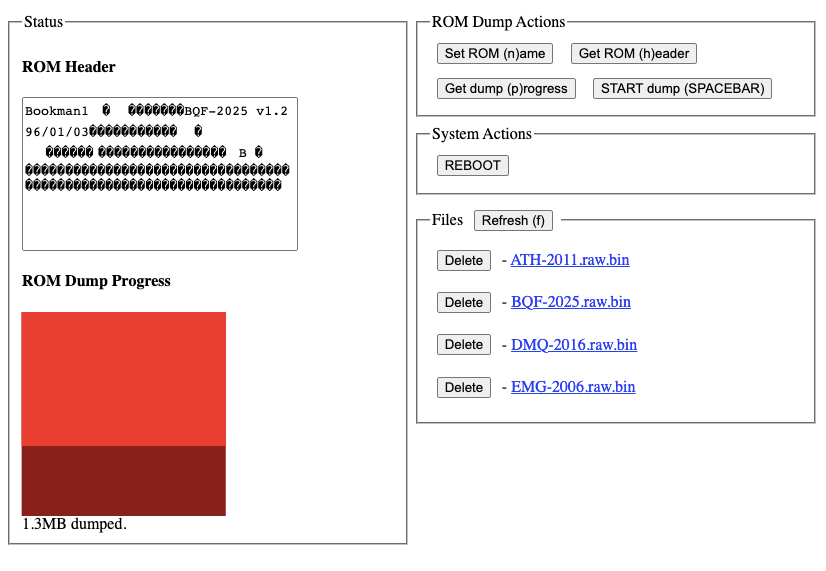
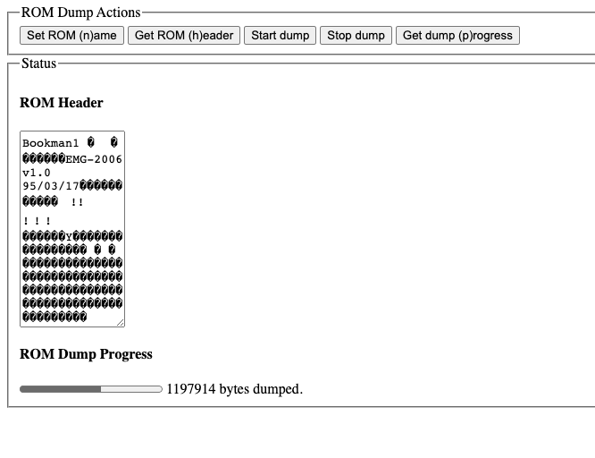

# i2c-prom-dumper






## Instructions

```
# Start process
pm2 start

# Save process list
pm2 save

# Restart the saved processes on reboot
pm2 startup
```

Go to http://raspberrypi.local:3000/ for the web interface.

```
Key press   Action
n           Set dump filename
q           Get the filename
p           Get current dump progress
h           Get first 0x100 bytes of the dump (expected ROM header)
```

