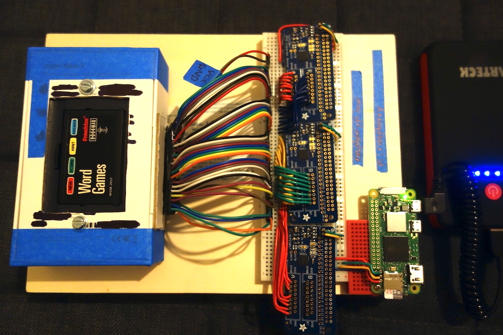
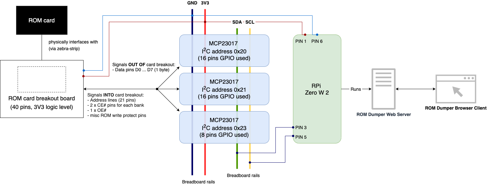

# rom-dumper

This tool dumps binary data from Franklin Bookman ROM cards. You can start / stop / track ROM dump progress via a web-based frontend.

These dumps are used for further binary analysis in the Bookman Archive emulator development project.

## Arduino Mega 2560 based dumper (using SPI bus + shift registers)

Coming soon, due to data corruption issues from the MCP23017 based solution

Advantages:
- Speed, much faster speeds with shift registers
- Lower level code on an MC means less to go wrong
    - Arduino acts as a pipe, dumps all bytes back out to serial port on connected machine

Disadvantages:
- No pretty web interface
- More coding required
- More soldering required for shift register daisy chaining

## Raspberry Pi based dumper (using I2C bus MCP23017 I/O expander)

Advantages:
- Many libraries available to work with MCP23017 and in a variety of languages
- Easy to configure signal direction in software

Disadvantages:
- I2C bus is much slower than SPI
- Data corruption due to I2C bus hangs

### Frontend


Go to http://raspberrypi.local:3000/ for the web interface.

```
Key press   Action
p           Get current dump progress
h           Get first 0x100 bytes of the dump (expected ROM header)
```
### Backend




### System Block Diagram



### Setup

Hardware prerequisites:
- 1 x Raspberry Pi Zero W / Zero W 2 (or equivalents)
- 3 x [Adafruit GPIO expander](https://www.adafruit.com/product/4132)
    - Uses MCP23017
- 1 x 40-pin Franklin Bookman ROM card breakout board (DIY)
- Enable I2C interface on the Raspberry Pi

Software prerequisities: 
- LTS version of NodeJS (v18+)
- NodeJS Yarn package manager
- PM2 process manager
- Cloned a copy of this repo
- Connected to your local Wifi
- [Set I2C baud rate to fast mode](https://raspberrypi.stackexchange.com/a/117910)

Running:

```
# Install project dependencies
yarn

# Run the frontend server
node webapp.js

# Then go to http://raspberrypi.local:3000 to access the web frontend
```

```
# Start process
pm2 start

# Save process list
pm2 save

# Restart the saved processes on reboot
pm2 startup
```
### Known issues
- Unable to handle 4MB / 2 IC ROM cards yet
- Persistant data corruption during dumping process
    - Unlikely due to timing (since a large delay can be added and corruption still observed for known ROMs)
        - This can be tweaked with the "ms read delay" variable in the frontend
    - Possibly MCP23017 or I2C issues?
    - Check I2C baud rate with `sudo cat /sys/kernel/debug/clk/clk_summary`
        - I2C rate is derived from CPU clock so if CPU scales down then I2C clock is affected
    - [Make CPU clock speed constant](https://forums.raspberrypi.com/viewtopic.php?t=325091#p1946018)
        - Doesn't seem to make a difference for some ROM cards
    - Likely different address pin mapping? Or perhaps some pins which are switched on (BYTE# in Bookman3 mapping should be floated)


## Additional tools
- Some binary comparison utilities available in `utils` for debugging line signals / mappings

